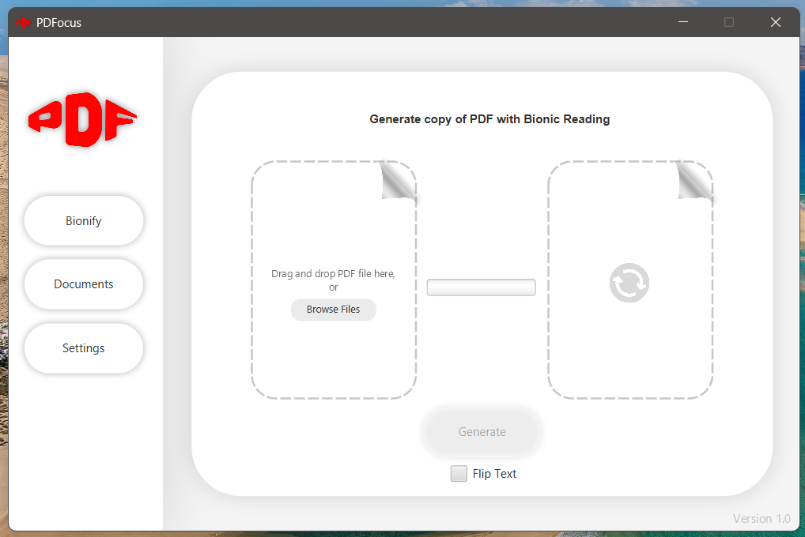
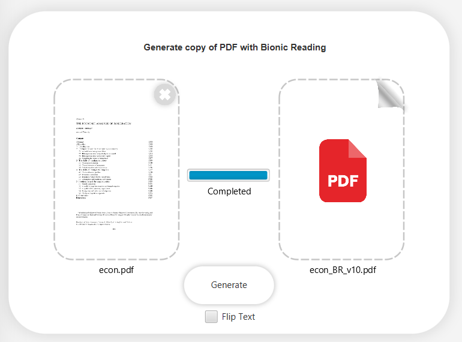
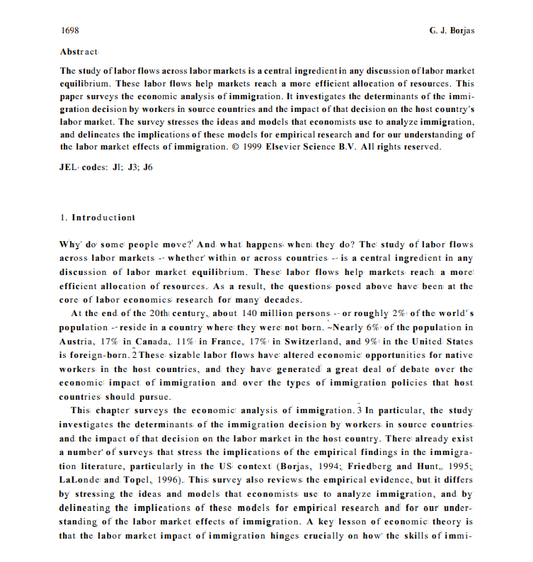

# Bionic Reading JavaFx Application with Apache PDFBox Parsing and Manipulation

## Designed to enhance pdf readability using the Bionic Reading technique for faster and focused reading.

PDFocus is a desktop application that enhances how you read by applying the Bionic Reading technique to PDF files. Built with Java and JavaFX, it bolds words to guide your eyes through text more efficiently, helping you read faster and stay focused longer. Using Apache PDFBox for text processing the app allows you to upload and apply bionic reading formatting to PDF documents. The following features offers a seemless experience in your document processing toolkit:

* Import and process standard PDF files
* Convert and format text using Bionic Reading algorithm
* Export enhanced "Bionified" PDF files
* Built in document management for ease of access and manipulation
* Clean navigatable UI to maximize document enhancement environment

## Stack
* Java (core logic)
* JavaFX (UI: FXML/CSS)
* Apache PDFBox (PDF parsing and manipulation)
* Jackson (JSON serialization and deserialization)

#### Main Interface

#### Bionic Reading Generation

#### Results

## Installation
### !Windows 11 Only!
Download the latest .exe from the [releases](https://github.com/GioSMDev/PDFocus/releases) page.

## Known Problems
* PDFs converted from .docx format get flipped when bionic reading is applied: Temp Fix -> check the "Flip Text" box before generating "bionified" document.
* Scanned PDF documents result in inconsistent character mapping, particularly with special math symbols.
* Dark mode not yet implemented (will be by next release)

